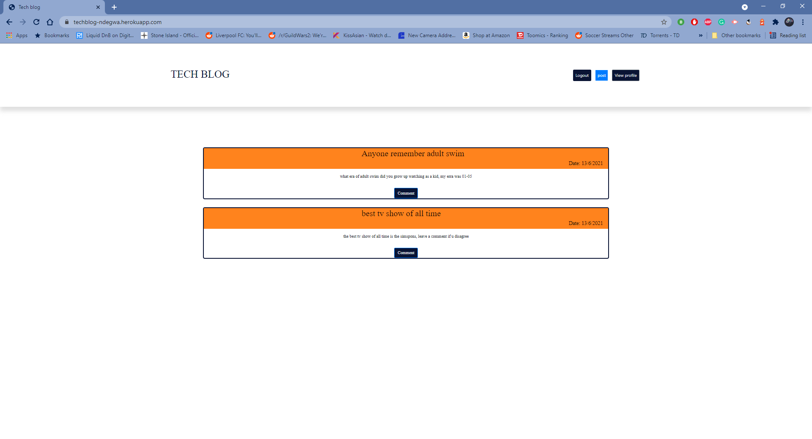

# tech-blog
MIT 

## Description
  Blog site where users can write,post,comment about anything. 
  
  ## Table of contents
  - [Description](#description)
  - [Table of contents](#table-of-contents)
  - [Installation](#installation)
  - [Images](#image)
  - [heroku](#youtube)
  - [Technologies](#technologies)
  - [License](#license)
  - [Contributing](#contributing)
  - [Questions](#questions)

## Installation

## Images 
 tech-blog host-s: 

e-commerce Pic: 

## heroku 

https://techblog-ndegwa.herokuapp.com/

# Technologies 
- 

## License MIT
I have used a mit License for this application, please see repository for documentation <https://github.com/anthony9292/Team-Generator-/blob/main/License.md>

## Contributing
   anthony9292

## Questions
For questions regarding this application please contact me at:
- E-mail anthon.n08@gmail.com 
- Github:<https://github.com/anthony9292>

    
